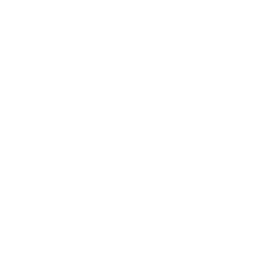
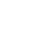

******************************
Assets for the Nengo ecosystem
******************************

When discussing the entire Nengo ecosystem,
which is typically what is
being referred to by the word "Nengo,"
use the following assets
in accordance with the
:ref:`guidelines <Nengo branding guidelines>`.

Full Nengo logo
===============

For light backgrounds.

.. image:: full-light.svg
   :width: 100%
   :alt: Full Nengo logo for light backgrounds

For dark backgrounds.

.. image:: full-dark.svg
   :width: 100%
   :class: dark
   :alt: Full Nengo logo for dark backgrounds

Square Nengo logo
=================

For light backgrounds.

For dark backgrounds.

Small square Nengo logo
=======================

For light backgrounds.

.. image:: small-light.svg
   :width: 48
   :alt: Small Nengo logo for light backgrounds

For dark backgrounds.

Recommended favicon.

.. image:: favicon.ico
   :alt: Nengo ecosystem favicon.
